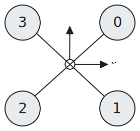
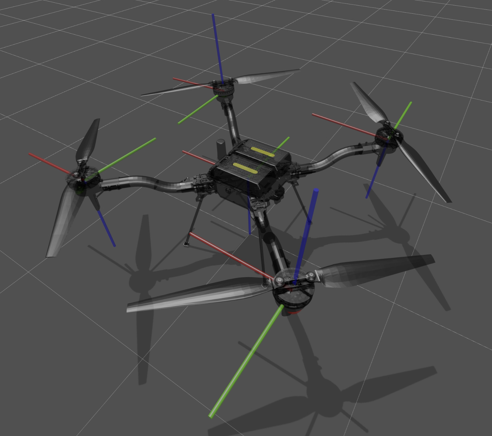
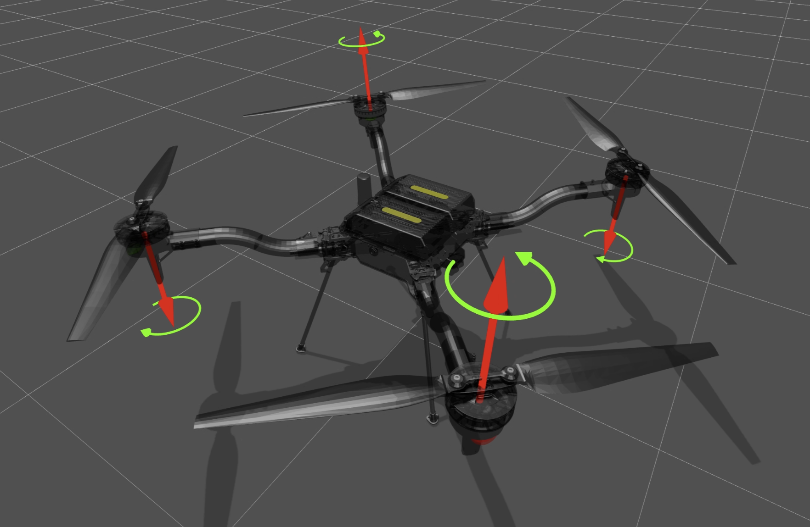

# Conventions
## Rotor Indexing

## Model Structure
 - **World**
    - **Body** (`body_frd`) link via "free joint" (floating base), FRD axes
      - **Rotor 1** (`rotor_1`) link via revolute joint, positive rotation along $z$ axis
      - ...
      - **Rotor 4** (`rotor_4`) link via revolute joint, positive rotation along $z$ axis

## Frames

| Frame     | Symbol          | Origin                         | Axes                                   |
| --------- | --------------- | ------------------------------ | -------------------------------------- |
| Body      | $\mathcal{B}$   | Vehicle center of gravity (CG) |  $x$ forward, $y$ right, $z$ down      |
| Rotor $i$ | $\mathcal{R}_i$ | Rotor CG                       | $x$ forward, $z$ according to rotation |

