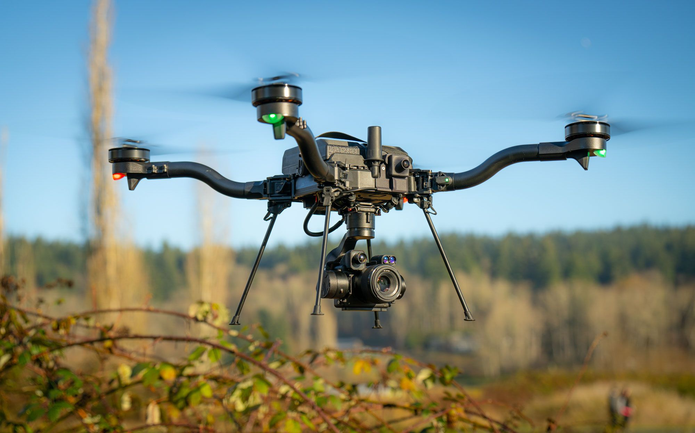

# Vehicles
:::warning
Currently, Newton only supports quadrotor vehicles.
:::
## Quad X

## Freefly Systems Astro Max
Astro is an industrial quadrotor for professional applications such as mapping and inspection. Learn more on the [Freefly Systems](https://freeflysystems.com/) website.

:::warning
The simulation does not claim to accurately mimic the flight dynamics of Astro. If you developing on Astro, do not fully rely on SITL to make conclusions about real-world behavior.
:::
